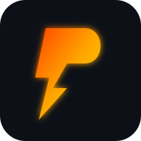

  
  <h1>⚡ PUBU ⚡</h1>
  
<strong>Maker Challenge Generator</strong>

  
<em>Bileşenlerini seç, zorluğunu belirle ve sınırları zorlayan projeni kurgula!</em>

 

## 💡 Proje Ne İşe Yarar ve Neden Yapıldı?

Elektronik projelerle uğraşıyorsan bazen masanın başına geçip:

> *"Acaba bugün ne yapsam?"* 

diye saatlerce düşündüğün ya da elindeki aynı standart sensörlerle hep aynı devreleri kurmaktan sıkıldığın olmuştur. 

**PUBU**, tam olarak bu yaratıcılık tıkanıklığını aşmak ve monotonluğu kırmak için geliştirildi. Elindeki malzeme havuzunu sisteme tanıtarak sana tamamen rastgele, sınırları zorlayan ve doğaçlama yeteneğini geliştiren özel proje görevleri (challenge) üreten eğlenceli bir rehberdir.

---

## 🎯 Kimlere Hitap Eder?

*   **Elektronik Tutkunları:** Arduino, ESP32, Raspberry Pi gibi kartlarla haşır neşir olan tüm maker'lar.
*   **Kendini Test Etmek İsteyenler:** Yeni başlayanlardan ileri düzey geliştiricilere kadar yaratıcılığını sınamak isteyen herkes.
*   **Eğitmenler ve Öğrenciler:** Hızlı proje fikirlerine ihtiyaç duyan atölye çalışanları, proje ödevi arayan öğrenciler ve öğretmenler.

---

## 🚀 Nasıl Kullanılır?

Sistemi kullanmak son derece basittir ve birkaç adımda kendi meydan okumanı yaratmanı sağlar:

1.  📦 **Envanterini Seç:** "Elimde hangi parça ve sensörler var?" diye düşünmene gerek yok. Listeden elinde olanları işaretle. Eğer listede olmayan özel bir parçan varsa, **"Kendi Parçanı Ekle"** bölümünü kullanarak istediğin zorluk seviyesiyle envanterine anında yeni bir parça ekle.
2.  ⚙️ **Kriterlerini Belirle:** Projeyi hangi mikrodenetleyiciyle (beyinle) yapmak istediğini seç, kaç tane bileşenle uğraşmak istediğini kaydırıcı ile ayarla ve kendine uygun zorluk seviyesini belirle.
3.  🎲 **Meydan Okumayı Başlat:** **"Yeni Meydan Okuma Üret"** butonuna bas. Sistemin senin için hazırladığı konsepti, zorunlu bileşenleri ve projeyi uçuracak ekstra öneri parçaları incele.
4.  ⏱️ **Süre Tut ve Kodlamaya Başla:** Alt kısımda yer alan dijital zamanlayıcıyı çalıştırarak kendine süre ver ve sınırlarını zorla.
5.  💾 **Kaydet ve Paylaş:** Projeni tamamladığında kopyalayabilir, beğendiğin konseptleri **"Favorilerim"** kısmına kaydedebilir veya iletişim formu üzerinden kendi fikirlerini toplulukla paylaşabilirsin!

---

## 🆕 Son Güncellemeler ve Yenilikler

Projemize kullanıcı deneyimini ve işlevselliği artırmak için iki yeni güçlü özellik eklendi:

*   🎮 **Seviye ve Rozet Sistemi (Gamification)**
    *   **XP ve Puan Kazanımı:** Kullanıcılar her meydan okumayı tamamladığında veya kronometre hedefini başarıyla bitirdiğinde deneyim puanı (XP) kazanır.
    *   **Dinamik Seviyeler:** Kazanılan puanlara göre otomatik seviye atlama sistemi (*Çırak, Devre Sihirbazı, Donanım Üstadı vb.*) devreye girer.
    *   **Kalıcı İlerleme:** Tüm puanlar ve açılan rozetler tarayıcının `localStorage` alanında saklanır; sayfa yenilense bile veriler kaybolmaz.

*   🔌 **Bağlantı İpucu Asistanı (Pinout & Wiring Guide)**
    *   **Akıllı Pin Eşleşmesi:** Seçilen mikrodenetleyici (Arduino Uno, ESP32 vb.) ve eklenen bileşenlerin (OLED Ekran, Sensörler vb.) standart pin bağlantıları otomatik olarak eşleştirilir.
    *   **Pratik Rehber:** Üretilen her devrenin altında, hangi bileşenin hangi pine (VCC, GND, SCL, SDA vb.) bağlanması gerektiğini gösteren temiz ve okunabilir bir bağlantı kılavuzu sunulur.
